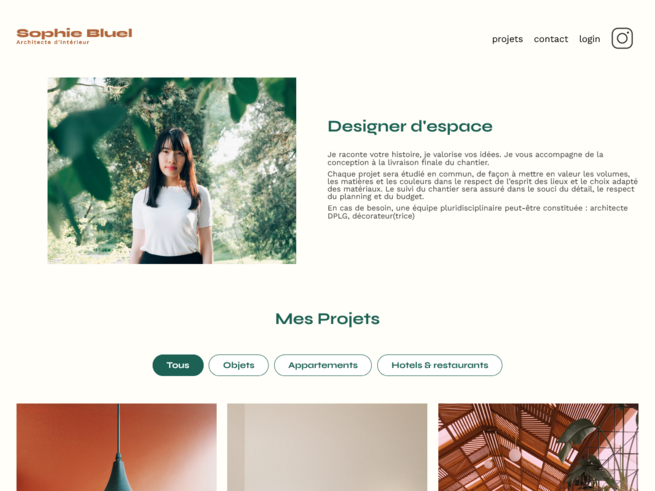
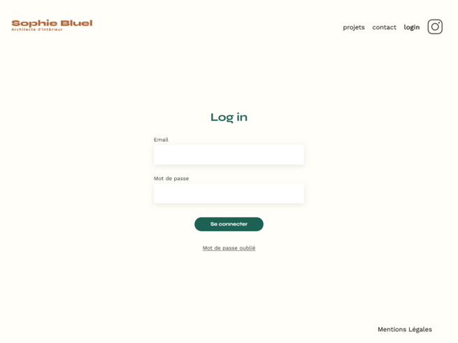

# OpenClassrooms - Sophie Bluel - Portfolio

This is my solution for the project n°6 - OpenClassrooms - Web integrator training : Sophie Bluel - Portfolio

## Table of content

- [overview](#overview)
    - [The project](#the-project)
    - [Screenshot](#screenshot)
    - [Links](#links)
- [My process](#my-process)
- [Skills evaluated](#skills-evaluated)
- [Information to launch the project](#information-to-launch-the-project)

## Oveview

### The project 

- Project : Development of a portfolio website for interior designer Sophie Bluel.

- Missions : 
    - Development of the homepage displaying the architect's works
    - Development of the login page for the website administration
    - Development of the modal window to manage the architect's works (add & remove projects)

- Final goal : First working version of the website front-end in desktop mode

### Screenshot

### Links

- Solution URL: [My github solution here](https://github.com/Amalynn/oc-iw-p6-sophie-bluel)

## My process

This project was built with :

- HTML5
- CSS3
- JavaScript

## Skills evaluated

- Manage users events with JavaScript
- Manipulate DOM elements with JavaScript
- Retrieve users data in JavaScript via forms

## Information to launch the project

 - Launch the backend from your terminal by following the instructions in the Readme file.
 - If you want to display the backend and frontend code, do it in two different VSCode instances to avaoid any problems.
 
